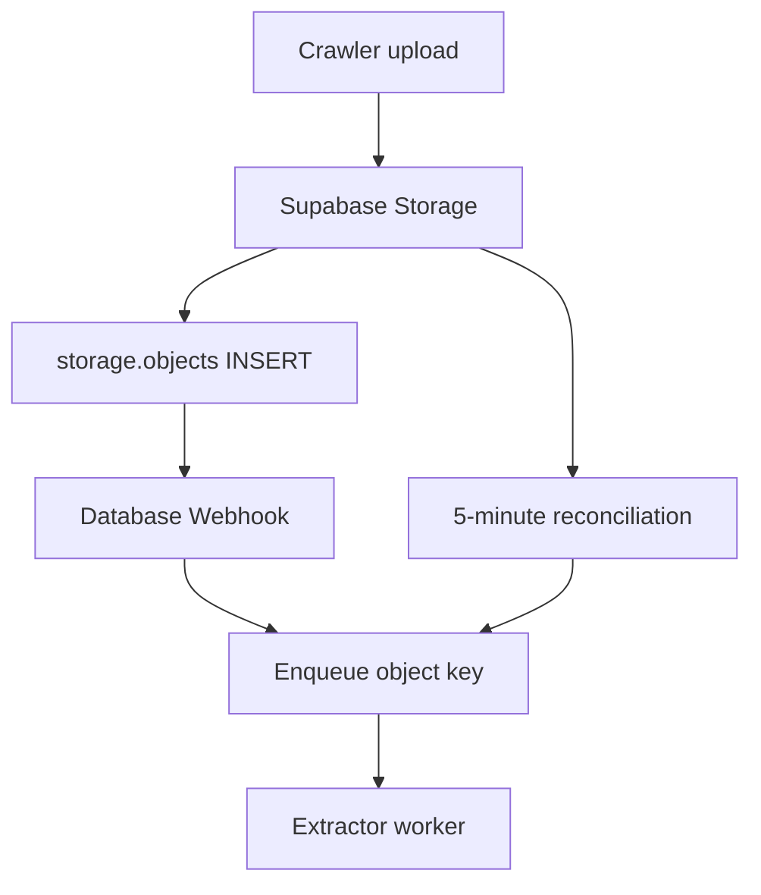

# Triggering extractors from Supabase Storage

**Status:** Accepted  
**Issue:** [#33](https://github.com/ShakedZrihen/data-pipeline-2026/issues/33)  
**Decision:** Use a Supabase Database Webhook for low-latency notification and
periodic S3 reconciliation for recovery.

## Context

The crawler uploads `PriceFull` and `PromoFull` objects to the `raw-prices`
bucket. The extractor needs to learn about new objects without repeatedly
processing old ones. Issue #33 asks whether Supabase supports a webhook for
this and, if not, whether polling would exceed a rate limit.

## Findings

### Supabase supports this webhook

Supabase Storage stores object metadata in the Postgres
[`storage.objects`](https://supabase.com/docs/guides/storage/schema/design)
table. Supabase Database Webhooks support `INSERT`, `UPDATE`, and `DELETE`
events on database tables and send the affected row in the HTTP payload. The
official Storage example creates a webhook on an insert into
`storage.objects`, so a new upload can trigger the extractor without listing
the bucket.

Sources:

- [Database Webhooks](https://supabase.com/docs/guides/database/webhooks)
- [Official Storage webhook example](https://supabase.com/docs/guides/ai/examples/huggingface-image-captioning)

An insert payload contains the new `storage.objects` record. The fields needed
by the extractor are:

- `record.bucket_id` — accept only `raw-prices`
- `record.name` — the S3 object key to download
- `record.id` — a stable event/idempotency identifier

Database Webhooks use the asynchronous `pg_net` extension, so the upload
transaction does not wait for the extractor to finish. The receiving endpoint
must acknowledge quickly and must not parse the file inside the webhook
request.

### Storage does not publish a simple requests-per-minute limit

Supabase documents Storage throttling through `429 Too Many Requests` and S3
`SlowDown` (`503`) responses rather than a fixed Storage requests-per-minute
quota. The documented `120 requests/minute` limit belongs to the Supabase
**Management API**, and the token-bucket limits belong to **Auth**; neither is
the Storage object API limit.

Sources:

- [Storage error codes](https://supabase.com/docs/guides/storage/debugging/error-codes)
- [Storage listing optimization](https://supabase.com/docs/guides/storage/production/scaling)
- [Management API limits](https://supabase.com/docs/reference/api/introduction#rate-limits)

Polling once per minute is therefore unlikely to be a rate-limit problem for
this project. It is still inefficient as the primary trigger: listing becomes
slower as the bucket grows, and every poll consumes a request even when no file
arrives.

## Decision

Use two complementary paths:

1. **Database Webhook (primary):** on `INSERT` to `storage.objects`, send the
   object metadata to a small ingestion endpoint. The endpoint validates the
   shared secret, filters `bucket_id == "raw-prices"`, records/enqueues the
   object key idempotently, and returns `2xx` immediately.
2. **Reconciliation poll (recovery):** every five minutes, list the bucket with
   pagination and enqueue any object that has no successful processing record.
   Retry `429`, `503`, and transient network failures using exponential backoff
   with jitter.

The webhook supplies low latency and avoids empty polls. Reconciliation makes
the pipeline self-healing if the endpoint is temporarily unavailable, a
webhook is misconfigured, or an operator uploads objects while the service is
down.



## Delivery contract

The ingestion endpoint should accept the standard Supabase insert payload:

```json
{
  "type": "INSERT",
  "table": "objects",
  "schema": "storage",
  "record": {
    "id": "object-uuid",
    "bucket_id": "raw-prices",
    "name": "shufersal/PriceFull7290027600007-001-202608230100.gz"
  },
  "old_record": null
}
```

Required behavior:

- Reject requests without the configured webhook secret.
- Ignore events for other buckets and unsupported file types.
- Deduplicate using `(bucket_id, name)`; redelivery must be safe.
- Persist/enqueue before returning `2xx`.
- Return quickly; downloading and parsing belong to the worker.
- Record `pending`, `processing`, `succeeded`, and `failed` states so the
  reconciliation poll can identify missing or retryable work.

## Supabase configuration

Create a Database Webhook in the Supabase dashboard:

1. Choose schema `storage` and table `objects`.
2. Select the `INSERT` event.
3. Use `POST` and the public ingestion endpoint URL.
4. Add `Content-Type: application/json` and a random secret header, for
   example `X-Salim-Webhook-Secret`.
5. Store the same secret only in the extractor service environment.
6. Inspect delivery history in the database `net` schema during rollout.

The endpoint must still filter `bucket_id`, because a table-level webhook also
receives inserts made for other buckets.

## Polling fallback algorithm

```text
every 5 minutes:
    continuation_token = null
    do:
        page = list_objects_v2(raw-prices, continuation_token)
        for object in page:
            enqueue_if_not_processed(object.key)
        continuation_token = page.next_continuation_token
    while continuation_token exists
```

Do not use only “latest modified timestamp” as the checkpoint: uploads can
arrive out of order and multiple objects can share a timestamp. The processing
record keyed by `(bucket_id, name)` is the source of truth.

## Alternatives considered

### Webhook only

Lowest latency and fewest Storage requests, but it has no independent recovery
path. A missed or misconfigured delivery can leave an object unprocessed.

### Polling only

Simple and acceptable at the current scale, but continuously lists an
ever-growing bucket and adds up to one polling interval of latency. It remains
the fallback if Database Webhooks cannot be enabled in the project.

### Run extraction inside the webhook

Rejected. Database Webhooks are notifications, not a compute runtime. File
downloads and parsing can exceed HTTP timeouts and would couple Storage uploads
to extractor availability.

## Verification plan

Before enabling this in production:

1. Upload one supported file and verify exactly one processing record appears.
2. Replay the same payload and verify no duplicate work is created.
3. Upload to another bucket and verify it is ignored.
4. Disable the endpoint, upload a file, re-enable it, and verify reconciliation
   discovers the missed object within five minutes.
5. Simulate `429` and `503` list responses and verify backoff rather than a busy
   retry loop.

